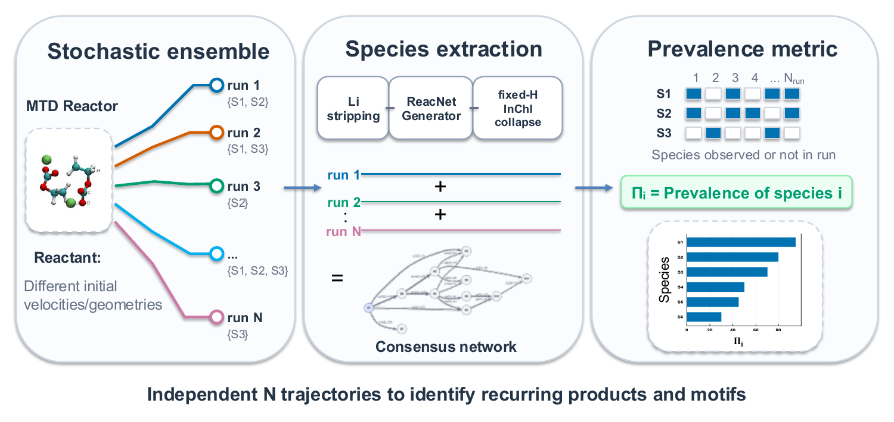

# EnsembleMTD

Ensemble RMSD-driven metadynamics for electrolyte-reduction pathway discovery.

A single RMSD-biased GFN2-xTB trajectory of a reducing carbonate cluster is not
worth much on its own. The bias promotes escape from visited structures without
being told which bonds matter, which is exactly what you want for discovery, but
it also makes each trajectory strongly path dependent: several radical branches
are nearly degenerate, so run 3 and run 11 can end somewhere quite different.
This repository runs many independent trajectories from one starting geometry
and then asks which species and which reaction steps come back across them.



The number that comes out is the species prevalence

$$\Pi_i = 100\,\% \times \frac{N_i^\mathrm{runs}}{N_\mathrm{total}^\mathrm{runs}},
\qquad N_i^\mathrm{runs} = \sum_k I_{ik},\quad I_{ik}\in\{0,1\}$$

with $I_{ik} = 1$ when species $i$ appears in at least one frame of successful
run $k$. It is binary per run: a species that persists for a whole trajectory
and one that flickers for a single frame both contribute exactly 1. So $\Pi_i$
measures **reproducibility across independent trajectories** — not abundance,
residence time, yield, or branching ratio. Please see
[what the numbers do and do not mean](docs/interpretation.md) before quoting
any of them.

The code behind [*Ensemble RMSD-Driven Metadynamics for Electrolyte-Reduction
Pathway Discovery*](#citation) (A. Aboobacker, A. Heuer, D. Diddens).

## What is here

Two stages, matching the figure above.

**`reactor/`** — build a cluster and run the ensemble. Shell, because it drives
`crest` and `xtb` and submits through SLURM.

| Script | Does |
|---|---|
| `genmol.sh` | Embeds each SMILES fragment with Open Babel and packs them into a sphere or cube of a given packing density (Packmol) |
| `setup_reactor.sh` | Per ensemble member: `crest --reactor` writes an `rcontrol` template, a short unbiased MD relaxes the geometry, then the biased MTD runs. Rescales `kpush`, adds the log-Fermi wall, resumes an existing ensemble instead of restarting it |

**`ensemblemtd`** — turn the ensemble into numbers. Python, installed as two
commands.

| Command | Does |
|---|---|
| `ensemble-mtd-aggregate` | Strips Li, runs ReacNetGenerator per trajectory, collapses species by fixed-H InChI, writes $\Pi_i$, the consensus network and a browsable report |
| `ensemble-mtd-convergence` | Traces $\Pi_i$ against ensemble size, so you can see whether 20 runs was enough |

## Install

The reactor stage needs [`crest`](https://crest-lab.github.io/crest-docs/),
[`xtb`](https://xtb-docs.readthedocs.io/) (6.7.1 was used here),
[Packmol](https://m3g.github.io/packmol/) and
[Open Babel](https://openbabel.org/) on `PATH`, plus GNU `sed`/`awk`/`bc`.
The analysis stage needs Python 3.9+, Open Babel, and
[ReacNetGenerator](https://github.com/tongzhugroup/reacnetgenerator) (1.6.16).
Graphviz is optional: without `dot` you still get the `.dot` file to render
elsewhere.

```bash
git clone https://github.com/adilpsn/EnsembleMTD.git
cd EnsembleMTD
pip install -e ".[plots]"       # drop [plots] if you do not need the figure
```

## Running an ensemble

Build a starting geometry — one Li<sup>+</sup> and two EC molecules, packed into
a sphere:

```bash
./reactor/genmol.sh "[Li+].C1COC(=O)O1.C1COC(=O)O1" liec2
```

Then run twenty independent 30 ps trajectories from it. The positional
arguments are the geometry, the total charge, `k/N`, `alpha`, and the confining
density:

```bash
sbatch reactor/setup_reactor.sh liec2.xyz 0 0.5 0.6 5 \
    --time 30 --mddump 100 --nrun 20 --walltemp 1000.0 --nm liec2
```

That leaves `liec2k0.5_a0.6run1.trj` … `run20.trj` in the working directory.
`0.5 / 0.6 / 5` are the production settings from the paper; the reasoning
behind them, and when to change them, is in
[docs/parameters.md](docs/parameters.md).

Re-running the same command with `--nrun 30` adds runs 21–30 and leaves the
first twenty alone, which is how an ensemble gets topped up after a walltime
kill.

## Analysing it

```bash
ensemble-mtd-aggregate --inputs 'liec2k0.5_a0.6run*.trj' --outdir rcng \
    --nohmm --nproc 36 --clean
```

`--nohmm` matters. ReacNetGenerator's hidden-Markov filter, at its default
settings, removes short-lived intermediates — under an RMSD bias those are the
radicals worth counting.

The species table is the main result. This is the 2LiEC 40-run diagnostic
ensemble, where S1 is ring-opened EC and S5 is CO<sub>2</sub>:

```console
$ cut -f1,2,7,11 rcng/aggregate_reacnet_species.tsv | column -ts$'\t' | head -7
species_id  species                                  observed_run_support  pct_runs_observed
S1          [H][C]([H])[C]([H])([H])[O][C]([O])=[O]  37                    92.500
S2          [H][C]1([H])[O][C](=[O])[O][C]1([H])[H]  5                     12.500
S3          [H][C]([H])([O][C]([O])=[O])[C]([H])...  12                    30.000
S4          [H][C]([H])[C]([H])([H])[O][C](=[O])...  3                     7.500
S5          [O]=[C]=[O]                              34                    85.000
S6          [H][C]([H])[C]([H])[O][C]([O])=[O]       13                    32.500
```

(The two long SMILES are truncated here for width; the file has them in full.)

`aggregate_reacnet_network.dot` is the consensus network, with every edge
labelled by both numbers it rests on: `e` (event weight) and `r` (how many
independent runs support it). Render it with
`dot -Tpdf rcng/aggregate_reacnet_network.dot -o network.pdf`.
Every output file is described in [docs/outputs.md](docs/outputs.md).

Then check whether the ensemble was big enough:

```bash
ensemble-mtd-convergence rcng --production-size 20 \
    --out-csv convergence.csv --plot convergence.pdf
```

```console
40 runs, 5 species traced
    S1  Pi =  92.5%  band half-width at N=20: 7.5 pp  within +-5 pp from N = 14  ...
    S5  Pi =  85.0%  band half-width at N=20: 10.0 pp  within +-5 pp from N = 10  ...
    S7  Pi =  32.5%  band half-width at N=20: 12.5 pp  within +-5 pp from N = 27  ...
```

Which is the honest summary of the 2LiEC diagnostic set: twenty runs pin the
dominant chemistry, and are not enough to rank the minor species precisely.

## A note on reproducibility

ReacNetGenerator does not always write the same SMILES for the same fragment,
so re-running the pipeline on identical trajectories can change which string
labels a species — and how many raw strings a collapsed group absorbed. The
fixed-H InChI collapse exists partly to absorb that, and it does: across repeat
runs every $\Pi_i$ and every run-support count came out identical, while
`member_raw_species_count` moved. Details, and how to test it yourself, in
[docs/reproducibility.md](docs/reproducibility.md).

## Tests

```bash
pip install -e ".[dev]"
pytest                        # 269 tests
pytest -m unit                # the fast ones, no Open Babel needed
pytest --cov=ensemblemtd      # 96 %
```

The end-to-end tests replay captured ReacNetGenerator output through a stub
binary. That is deliberate: with the real thing they could not assert on
species labels at all.

## Citation

The manuscript is in preparation. Until it appears, please cite this
repository — `CITATION.cff` has the metadata.

## Licence

MIT, see [LICENSE](LICENSE). ReacNetGenerator, `crest`, `xtb`, Packmol and Open
Babel are separate projects under their own licences and are not distributed
here.
